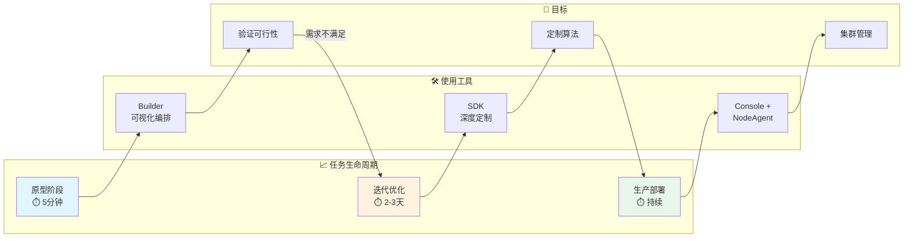
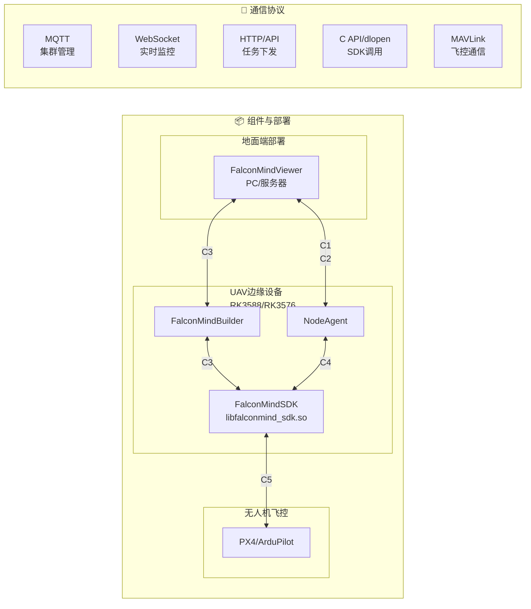
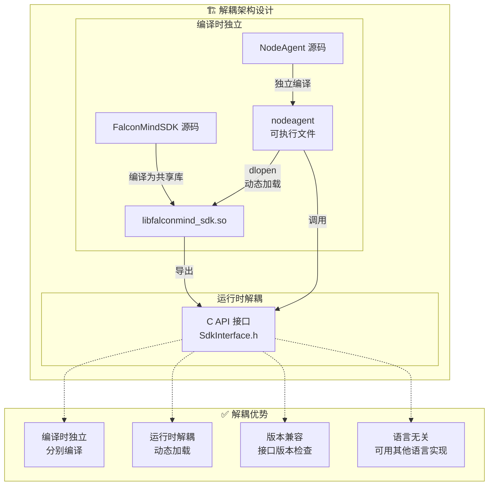
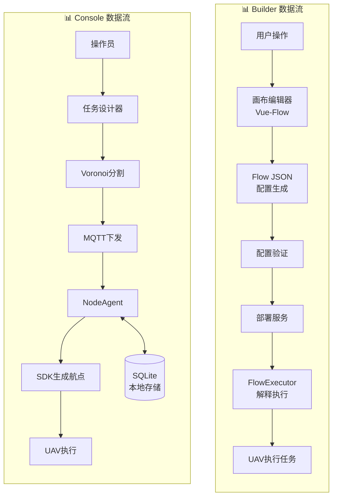
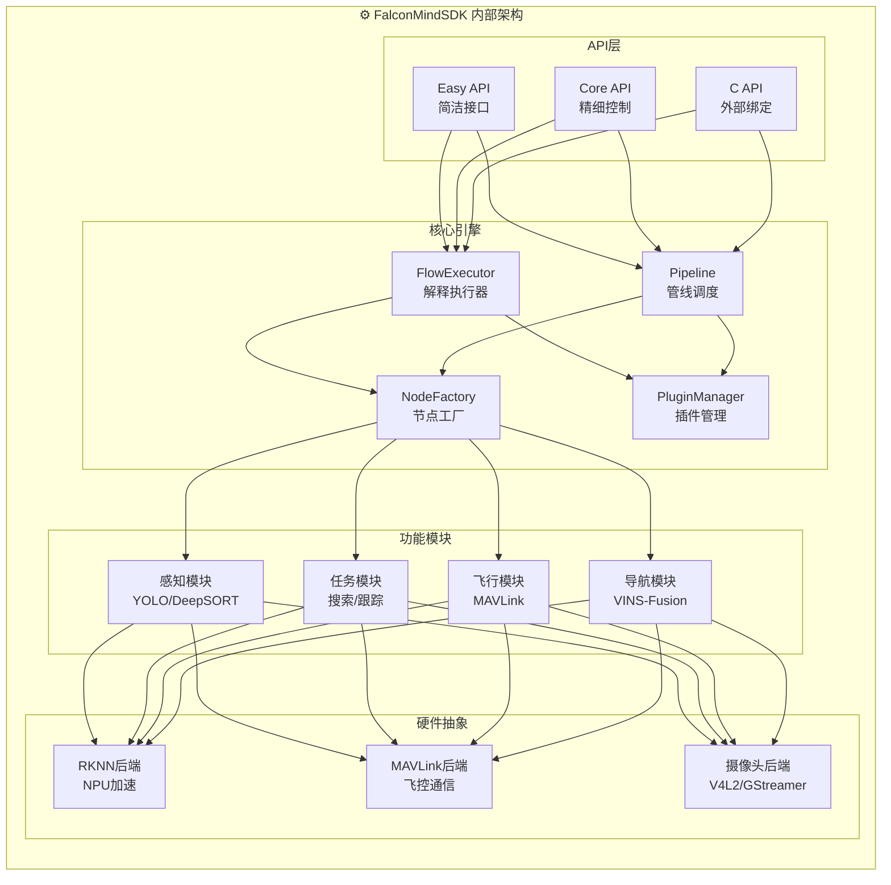
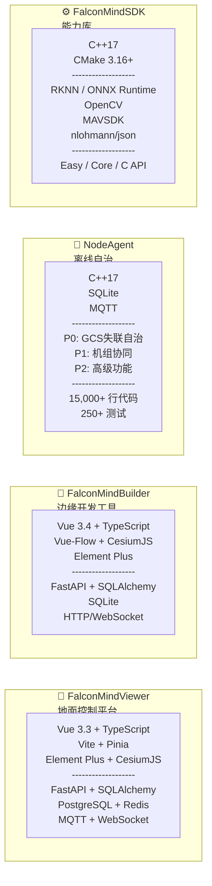
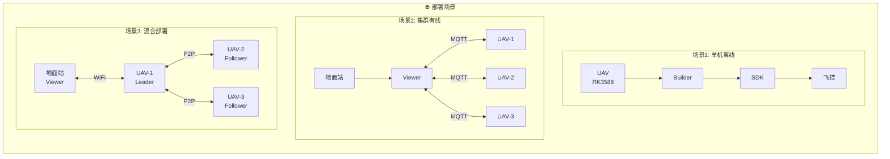
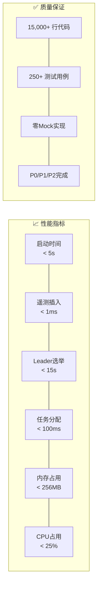

# FalconMind 应用模式与架构图

> 本文档提供 FalconMind 系统的应用模式图和应用架构图，帮助理解系统的设计理念和使用方式。

---

## 一、应用模式图

### 1.1 三种开发模式对比

```mermaid
graph TB
    subgraph "🎯 应用模式选择"
        USER[用户/开发者]
    end

    USER --> QUESTION1{是否需要<br/>集群管理/多机协同?}
    
    QUESTION1 -->|是| QUESTION2{是否需要<br/>离线自治?}
    QUESTION1 -->|否| QUESTION3{是否需要<br/>高度定制/新算法?}
    
    QUESTION2 -->|是| CONSOLE_NA[Console + NodeAgent]
    QUESTION2 -->|否| CONSOLE_ONLY[Console 开发]
    
    QUESTION3 -->|是| SDK_NATIVE[SDK 原生开发]
    QUESTION3 -->|否| QUESTION4{是否需要<br/>现场快速调试?}
    
    QUESTION4 -->|是| BUILDER[Builder 开发]
    QUESTION4 -->|否| CONSOLE_STD[Console 标准开发]
    
    subgraph "🔧 模式详情"
        BUILDER_DETAIL[Builder 边缘开发<br/>⭐ 零代码/低代码<br/>运行: UAV边缘<br/>网络: 可选(可离线)<br/>适用: 现场调试/快速原型]
        
        CONSOLE_DETAIL[Console 地面开发<br/>⭐ 集群管理<br/>运行: PC/服务器<br/>网络: 需要<br/>适用: 多机协同/集中管控]
        
        SDK_DETAIL[SDK 原生开发<br/>⭐ 完全定制<br/>运行: 编译部署<br/>门槛: 高(C++)<br/>适用: 复杂算法/深度定制]
        
        NA_DETAIL[NodeAgent<br/>⭐ 离线自治<br/>运行: UAV上<br/>网络: 无需<br/>适用: 断网自主决策]
    end
    
    BUILDER -.-> BUILDER_DETAIL
    CONSOLE_ONLY -.-> CONSOLE_DETAIL
    CONSOLE_NA -.-> CONSOLE_DETAIL
    CONSOLE_NA -.-> NA_DETAIL
    SDK_NATIVE -.-> SDK_DETAIL
    CONSOLE_STD -.-> CONSOLE_DETAIL
```

### 1.2 开发模式生命周期



### 1.3 典型使用场景

```mermaid
graph TB
    subgraph "🚁 场景1: 现场调试 (Builder)"
        S1_STEP1[1. 连接UAV WiFi]
        S1_STEP2[2. 浏览器访问<br/>http://uav-ip:8080]
        S1_STEP3[3. 拖拽编排任务]
        S1_STEP4[4. 点击部署<br/>即时生效]
        S1_STEP5[5. 实时监控]
        
        S1_STEP1 --> S1_STEP2 --> S1_STEP3 --> S1_STEP4 --> S1_STEP5
    end
    
    subgraph "🎮 场景2: 集群任务 (Console)"
        S2_STEP1[1. 地面站设计任务]
        S2_STEP2[2. Voronoi分割区域]
        S2_STEP3[3. MQTT下发任务]
        S2_STEP4[4. NodeAgent执行]
        S2_STEP5[5. 实时监控]
        
        S2_STEP1 --> S2_STEP2 --> S2_STEP3 --> S2_STEP4 --> S2_STEP5
    end
    
    subgraph "🔌 场景3: 离线自治 (NodeAgent)"
        S3_STEP1[初始: 机组内通信]
        S3_STEP2[GCS失联]
        S3_STEP3[P0: 切换自治模式]
        S3_STEP4[P1: Leader协调机群]
        S3_STEP5[网络恢复后同步数据]
        
        S3_STEP1 --> S3_STEP2 --> S3_STEP3 --> S3_STEP4 --> S3_STEP5
    end
```



---

## 二、应用架构图

### 2.1 三层架构总览

```mermaid
graph TB
    subgraph "🖥️ 业务编排层 - 任务编排工具"
        direction LR
        
        subgraph "FalconMindViewer<br/>(地面指控端)"
            V_FE[Vue3 + TypeScript<br/>CesiumJS + Element Plus]
            V_BE[FastAPI + PostgreSQL<br/>Redis + WebSocket]
        end
        
        subgraph "FalconMindBuilder<br/>(边缘内置端)"
            B_FE[Vue3 + TypeScript<br/>Vue-Flow + CesiumJS]
            B_BE[FastAPI + SQLite<br/>HTTP/WebSocket]
        end
        
        V_FE <--> V_BE
        B_FE <--> B_BE
    end
    
    subgraph "🧠 边缘自治层 - 自主大脑"
        direction TB
        
        NODEAGENT[NodeAgent<br/>C++17]
        
        subgraph "P0 - GCS失联自治"
            P0_1[HeartbeatMonitor<br/>心跳检测]
            P0_2[StateMachine<br/>状态机管理]
            P0_3[LocalStore<br/>SQLite存储]
        end
        
        subgraph "P1 - 机组协同自治"
            P1_1[InterUavManager<br/>机间通信]
            P1_2[LeaderElection<br/>Leader选举]
            P1_3[SwarmPartitionManager<br/>分区管理]
        end
        
        subgraph "P2 - 高级功能"
            P2_1[DistributedTaskAllocator<br/>任务分配]
            P2_2[ConflictResolver<br/>冲突解决]
            P2_3[PredictiveReconnector<br/>预测重连]
        end
        
        NODEAGENT --> P0_1 & P0_2 & P0_3
        NODEAGENT --> P1_1 & P1_2 & P1_3
        NODEAGENT --> P2_1 & P2_2 & P2_2
    end
    
    subgraph "⚙️ 能力层 - 原子能力库"
        direction TB
        
        SDK[FalconMindSDK<br/>C++17]
        
        subgraph "核心模块"
            M_PERCEPTION[AI感知<br/>YOLO + DeepSORT]
            M_MISSION[任务规划<br/>行为树 + 航点规划]
            M_FLIGHT[飞行控制<br/>MAVLink协议]
            M_NAVIGATION[视觉导航<br/>VINS-Fusion]
            M_STORAGE[数据存储<br/>SQLite]
        end
        
        subgraph "执行引擎"
            E_FLOW[FlowExecutor<br/>配置解释执行]
            E_PIPELINE[Pipeline<br/>管线调度]
            E_PLUGIN[PluginManager<br/>热更新]
        end
        
        SDK --> M_PERCEPTION & M_MISSION & M_FLIGHT & M_NAVIGATION & M_STORAGE
        SDK --> E_FLOW & E_PIPELINE & E_PLUGIN
    end
    
    subgraph "🚁 硬件层"
        UAV[无人机<br/>PX4/ArduPilot]
        NPU[RK3588/RK3576<br/>NPU加速]
        CAMERA[摄像头/传感器]
    end
    
    %% 层间连接
    V_BE -.->|MQTT/WebSocket| NODEAGENT
    B_BE -.->|HTTP/API| SDK
    NODEAGENT -.->|dlopen/C API| SDK
    SDK -.->|MAVLink| UAV
    SDK -.->|RKNN| NPU
    SDK -.->|V4L2/GStreamer| CAMERA
```



### 2.2 组件关系详解



### 2.3 NodeAgent 解耦架构



### 2.4 数据流架构



### 2.5 SDK 架构细节



---

## 三、技术栈总览

### 3.1 组件技术栈



### 3.2 部署架构



---

## 四、关键设计决策

### 4.1 架构设计决策

| 决策 | 选择 | 原因 |
|------|------|------|
| **Builder位置** | 边缘侧(UAV上) | 直连UAV、即时部署、可离线使用 |
| **Console与Builder关系** | 并列可选 | 根据场景选择, Console可集成Builder功能 |
| **NodeAgent与SDK关系** | 运行时解耦 | 编译独立、动态加载、版本兼容 |
| **配置执行方式** | 解释执行 | 无需编译、在线编辑即时生效 |
| **API风格** | 三种并存 | Easy(快速)、Core(精细)、C(外部绑定) |

### 4.2 性能指标



---

## 五、快速参考

### 5.1 组件速查表

| 组件 | 层级 | 运行位置 | 网络依赖 | 核心功能 |
|------|------|----------|----------|----------|
| **Viewer** | 业务编排层 | PC/服务器 | 需要 | 集群监控、任务管理 |
| **Builder** | 业务编排层 | UAV边缘 | **可选** | 可视化编排、即时部署 |
| **NodeAgent** | 边缘自治层 | UAV上 | **无需** | 离线决策、任务执行 |
| **SDK** | 能力层 | 编译进组件 | 组件决定 | AI感知、飞行控制 |

### 5.2 文件路径速查

```
FalconMind/
├── FalconMindViewer/          # 地面控制平台
│   ├── frontend/              # Vue3前端
│   ├── backend/               # FastAPI后端
│   └── docs/architecture/     # 架构文档
│
├── FalconMindBuilder/         # 边缘开发工具
│   ├── frontend/              # Vue3 + Vue-Flow
│   ├── backend/               # FastAPI
│   └── Doc/                   # 8个设计文档
│
├── FalconMindSDK/             # SDK核心
│   ├── include/falconmind/sdk/# 头文件
│   ├── src/                   # 实现源码
│   ├── NodeAgent/             # 离线自治系统
│   │   ├── src/               # 15,000+ 行C++
│   │   ├── tests/             # 250+ 测试
│   │   └── docker/            # Docker部署
│   └── scenarios/             # 20个PoC场景
│
└── docs/architecture/         # 架构图与文档
    └── architecture-diagrams.md  # 本文件
```

---

**文档版本**: v1.0  
**更新日期**: 2026-03-05  
**关联文档**: 
- [FALCONMIND_ARCHITECTURE.md](../FALCONMIND_ARCHITECTURE.md)
- [README.md](../README.md)
- [FalconMindSDK/NodeAgent/README.md](../FalconMindSDK/NodeAgent/README.md)
